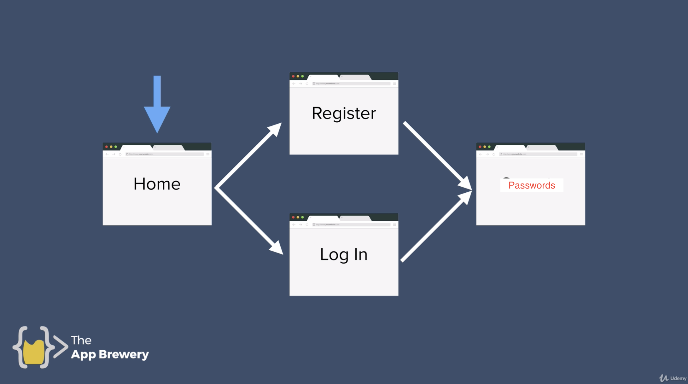

# passMan

## Description

Wanted to build a tool to keep track of things like passwords, notes, software license numbers, and gift ideas? User login and simliar to a password manager.

Password manager, that lets you login or signup and manage your passwords.

## Tech stack

* Node JS
* Express
* Handlebars
* bcrypt - (the C++ version for SPEEEED)
  * Salt rounds and storing the hash
* ~Passport JS~
* ~Sessions and Cookies~
* Jquery
* Javascript, html, css
* MYSQL
* ESLint
* Mocha and Chai
* Sequelize

## Flow

